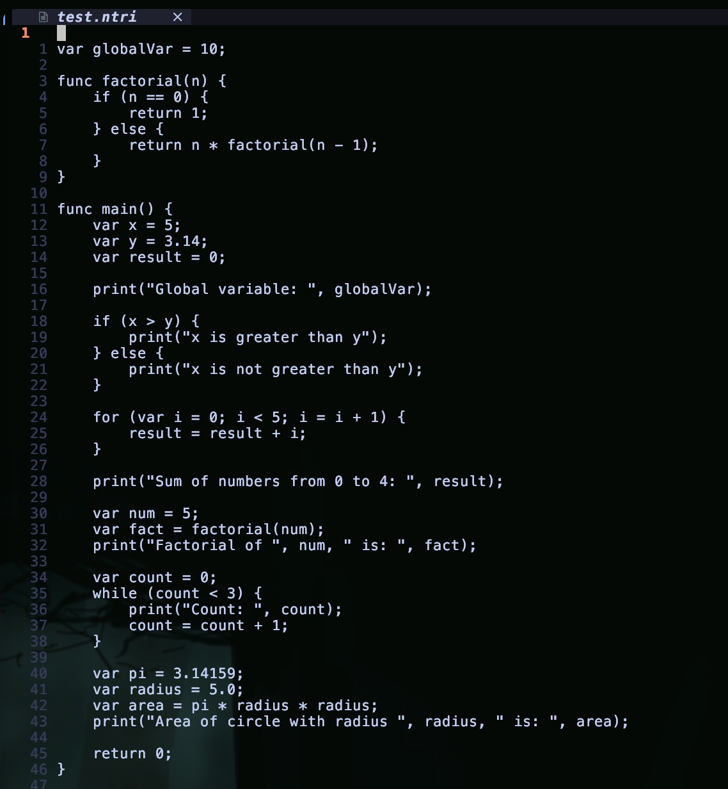

# Nutri-lang

1. 📚 **Define the Language Specification**

   - Syntax and Grammar:
     - Variables: `var x = 10;`
     - Arithmetic operations: `+`, `-`, `*`, `/`
     - Comparison operators: `==`, `!=`, `<`, `>`, `<=`, `>=`
     - Control flow: `if`, `else`, `while`, `for`
     - Functions: `func add(a, b) { return a + b; }`
   - Data Types: `int`, `float`, `bool`, `string`

2. 🧩 **Choose a Parsing Technique**

   - We'll use a recursive descent parser for simplicity.
   - Lexical structure:
     - Keywords: `var`, `if`, `else`, `while`, `for`, `func`, `return`
     - Identifiers: Alphanumeric characters and underscores, starting with a letter or underscore.
     - Literals: Integers, floating-point numbers, booleans (`true`, `false`), strings (enclosed in double quotes).
     - Operators: `+`, `-`, `*`, `/`, `==`, `!=`, `<`, `>`, `<=`, `>=`, `=`
     - Delimiters: `(`, `)`, `{`, `}`, `;`

3. 🛠️ **Implement the Lexer and Parser**

   - Lexer
   - Parser

4. 🌳 **Design the Abstract Syntax Tree (AST)**

   - Define AST node classes:

5. 🧪 **Implement Semantic Analysis**

   - Perform type checking and variable scoping:

6. 🎯 **Code Generation or Interpretation**

   - We'll create an interpreter to execute the AST:

7. 🧪 **Testing and Refinement**

   - Write test cases to cover various language features and edge cases:

8. 📖 **Documentation and Tooling**
   - Document the language syntax, semantics, and usage guidelines.
   - Develop a command-line interface (CLI) to run the interpreter:
